## 

### Energy is Uneven

::: {.incremental

- Energy consumption is highly uneven.

- High-energy lifestyles depend on high energy flow.

- Consumption Geographies ≠  Production Geographies.

- Benefit Geographies ≠ Burdened Geographies.

:::

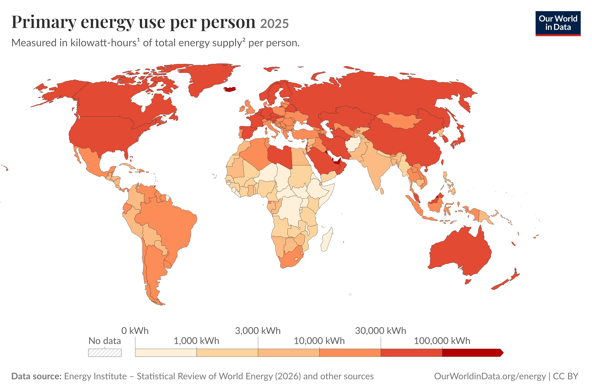{.absolute top="370" left="270" width="500"}

::: footer
Source: [Our World In Data](https://ourworldindata.org/energy-production-consumption)
:::

## 

### Every System Produces Payoffs

- Energy systems produce useful outcomes.
- Energy enables mobility, production, heating, cooling, and communication.
- Economic and social value.
- But we must ask: what value exactly — and for whom.

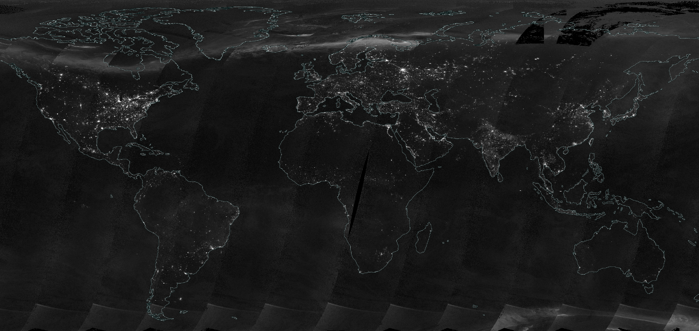{.absolute top="400" left="220" width="630"}

::: footer
Source: [Nasa Worldview - Night Lights](https://worldview.earthdata.nasa.gov/?v=-77.32728811432072,38.75432510527989,-70.95420891928434,42.293339078340836&l=DoS_International_Boundaries(hidden),Reference_Labels_15m(hidden),Coastlines_15m(hidden),VIIRS_SNPP_DayNightBand_ENCC(hidden),VIIRS_Night_Lights(hidden),VIIRS_SNPP_CorrectedReflectance_TrueColor(hidden),MODIS_Aqua_CorrectedReflectance_TrueColor(hidden),MODIS_Terra_CorrectedReflectance_TrueColor(hidden),VIIRS_Black_Marble&lg=false&t=2016-09-09-T22%3A24%3A49Z)
:::

## 

### Payoffs Require Tradoffs

::: {.incremental}

- Systems operate within constraints and competing priorities.
- Increasing one benefit can require giving something else up.
- Tradeoffs distribute gains and losses differently.
- Ask: What is gained? What is lost? Who decides?

:::

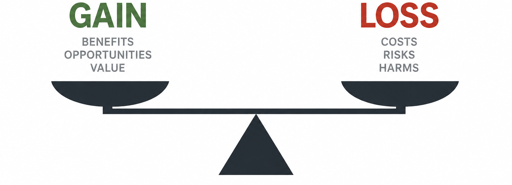{.absolute top="470" left="220" width="630"}

## 

### Who Receives Benefits?

::: {.incremental}

- Extraction and production generate goods, energy, jobs, and profits.

- Global systems move these benefits across enormous distances.

- Consumption can occur far from extraction and production.

:::

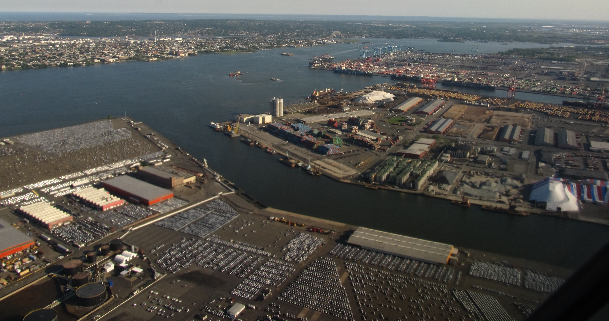{.absolute top="400" left="240" width="550"}

##

### Who Bears the Costs?

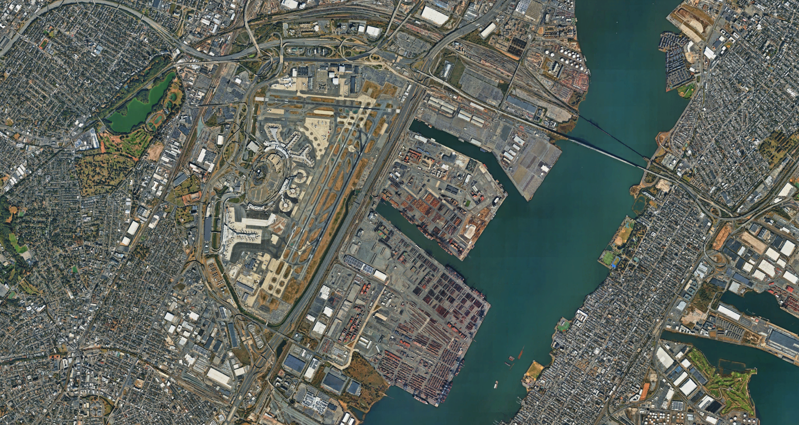{.absolute top="140" left="40" width="1900"}

##

### Who Bears the Costs?

- Extraction and production also generate waste, pollution, risk, and disruption.
- These costs are often concentrated near sites of extraction, production, and disposal.
- The people receiving the benefits may be different from those experiencing the burdens.
- Ask: Who bears the cost—and where are they?

##

### Externality

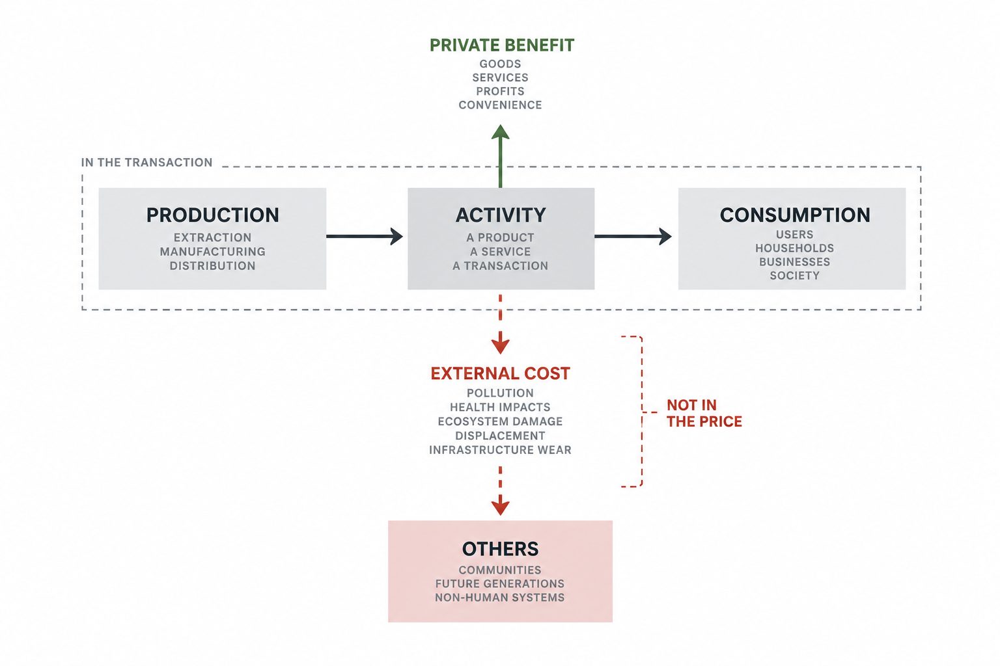{.absolute top="70" left="40" width="1900"}

##

### Negative Externality

- A decision can create a private benefit while imposing costs on others.

- Driving provides mobility, convenience, and access to the driver.

- Traffic produces air pollution, congestion, noise, and risk beyond the driver.

- These additional costs are external to the individual transaction.

##

### Negative Externality

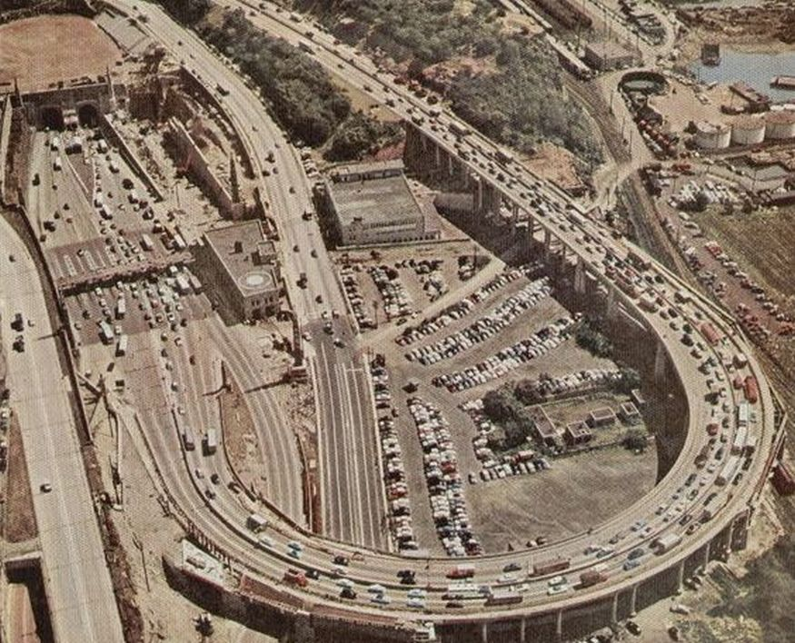{.absolute top="180" left="250" width="550"}

::: footer
Lincoln Tunnel as seen in 1955
:::

## 

### Capitalism is the System

> Capitalism is an economic system in which productive assets are largely privately owned, goods and services are exchanged through markets, and production is generally organized in pursuit of profit.

- Private ownership — individuals and firms control productive assets.

- Markets — goods, services, labor, and resources are exchanged.

- Profit — production seeks returns beyond its costs.

- Competition — creates pressure for cost reduction.

##

### Costs have Geography

> Elsewhere is a place.

- Environmental costs are distributed across people, places, and time.

- Production and consumption often occur in different geographies.

- Infrastructure connects distant places into a single system.

- Externalities can therefore extend far beyond the site of production.

##

### Systems Connect Places

- Materials and energy move through linked stages of production and consumption.

- Extraction, processing, transport, use, and disposal occur in different places.

- Benefits can move through the system while costs remain concentrated at particular sites.

- A local activity can therefore belong to a much larger territorial system.

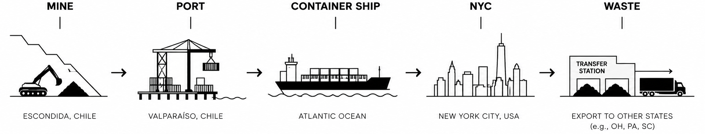{.absolute top="570" left="180" width="780"}

##

### Burdens Accumulate (Intensification)

- Externalities rarely occur one at a time.
- Infrastructure and industry tend to cluster in particular places.
- Multiple sources can produce overlapping environmental burdens.
- Burdens can also accumulate over time and across generations.

## 

### Burdens Accumulate (Intensification)

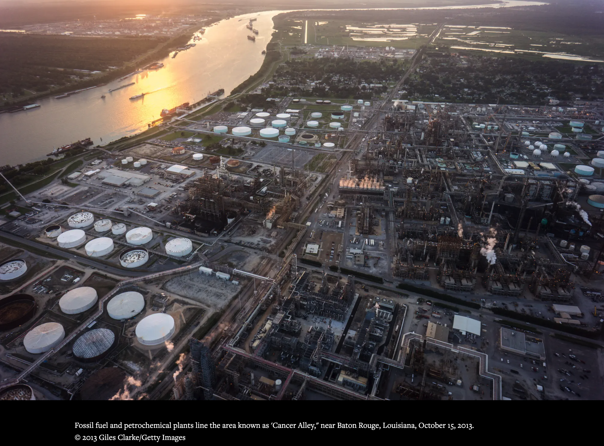{.absolute top="80" left="150" width="800"}

::: footer
Source: [HRW Report 2024](https://www.hrw.org/report/2024/01/25/were-dying-here/fight-life-louisiana-fossil-fuel-sacrifice-zone)
:::

##

### Burdens Accumulate (Intensification)

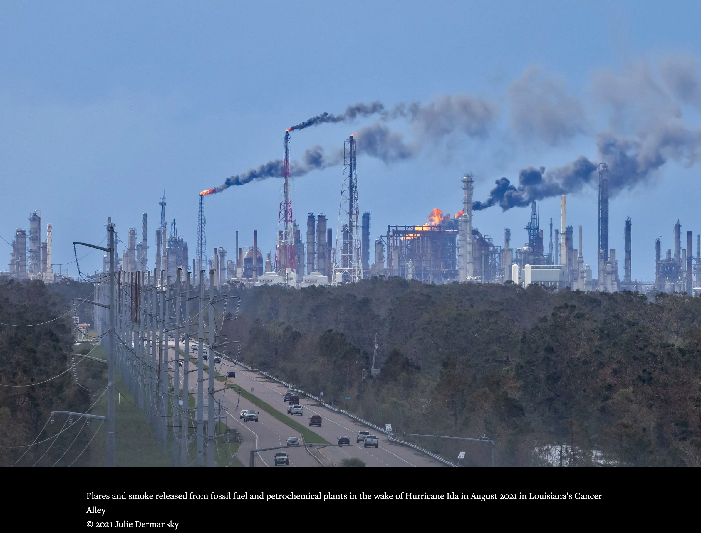{.absolute top="80" left="150" width="800"}

::: footer
Source: [HRW Report 2024](https://www.hrw.org/report/2024/01/25/were-dying-here/fight-life-louisiana-fossil-fuel-sacrifice-zone)
:::

##

### Proximity Matters

- Environmental risk is often understood through distance from a source.

- Greater proximity can mean greater exposure, vulnerability, or consequence.

- Boundaries and buffer zones attempt to translate risk into measurable space.

- But distance alone does not determine impact.

## 

### Proximity 

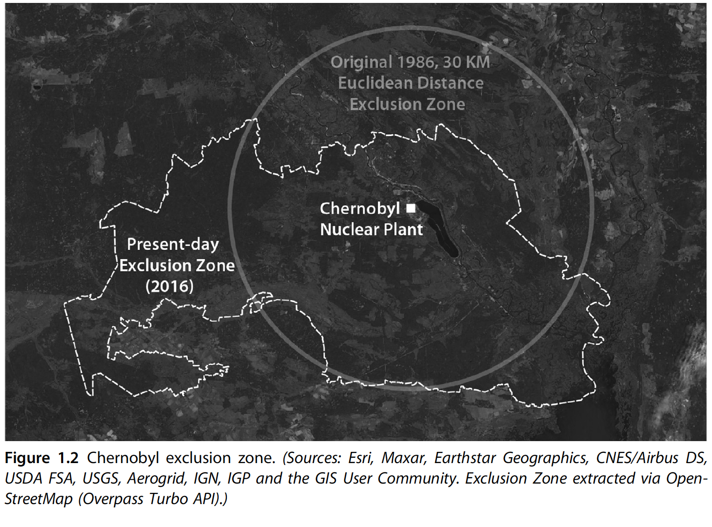{.absolute top="110" left="75" width="800"}

## 

### Proximity 

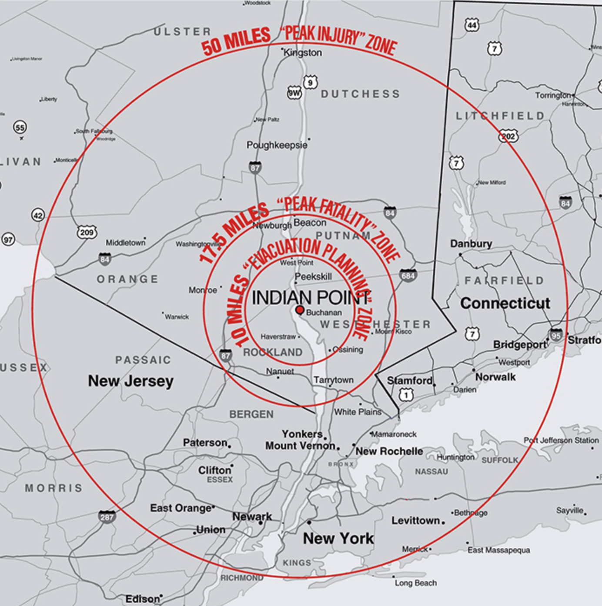{.absolute top="90" left="200" width="600"}

## 

### Proximity 

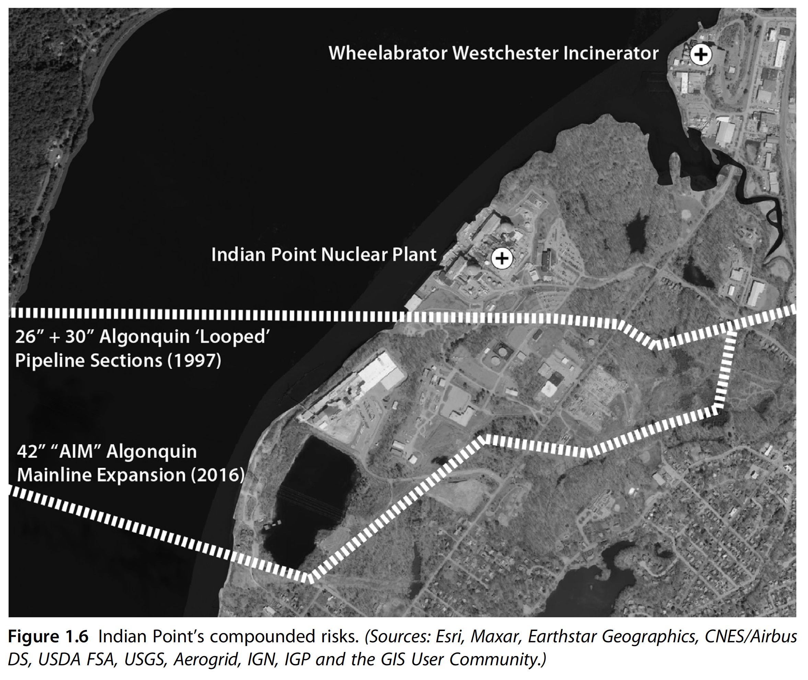{.absolute top="90" left="200" width="700"}

::: footer
Note: Co-location, Intensification of risk, Segmentation, Time, Cumulative Impacts
:::

##

### Proximity ≠ Distance

- Distance measures how far one place is from another.

- Proximity describes how places are connected through environmental and infrastructural systems.

- Air, water, infrastructure, and movement can extend impacts beyond physical adjacency.

- Proximity is therefore a relationship, not simply a measurement.

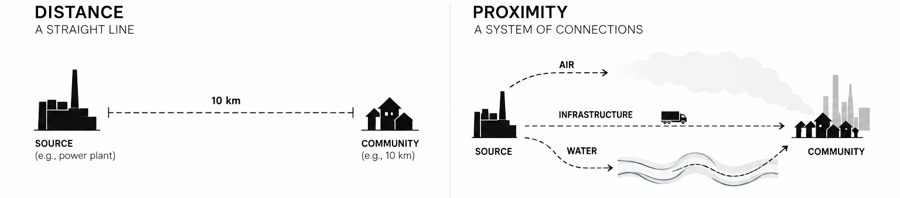{.absolute top="520" left="120" width="780"}

##

### Energy Violence: Fast vs Slow

 
 
 

***Proximity to Energy Infrastructure** often involves risk - risk of violence.  Like climate risk from climate change itself - **Energy Violence** can be split into acute risks, which translate as **fast violence**, while chronic risks represent **slow violence**.*

##

### Fast Violence

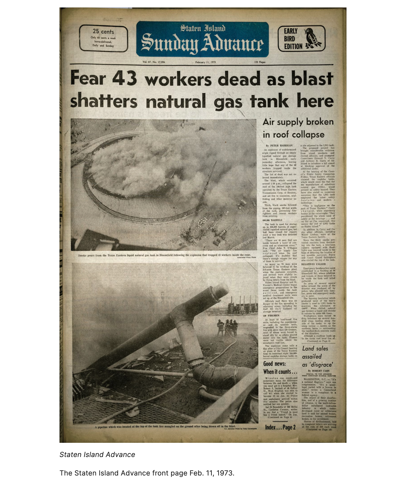{.absolute top="50" left="250" width="550"}

::: footer
Source: [Fast Violence: 1973 - Staten Island,NY](https://pipelinesafetycoalition.org/2020/02/11/on-this-day-in-1973-staten-island-liquefied-natural-gas-explosion-kills-40-workers/)
:::

##

### Fast Violence

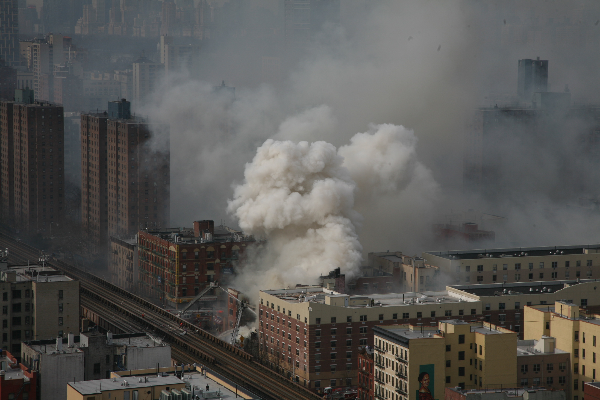{.absolute top="80" left="80" width="870"}

::: footer
Source: [Fast Violence: March 12, 2014 - East Harlem Gas Explosion](https://en.wikipedia.org/wiki/2014_East_Harlem_gas_explosion)
:::

##

### Everyday Fast Violence

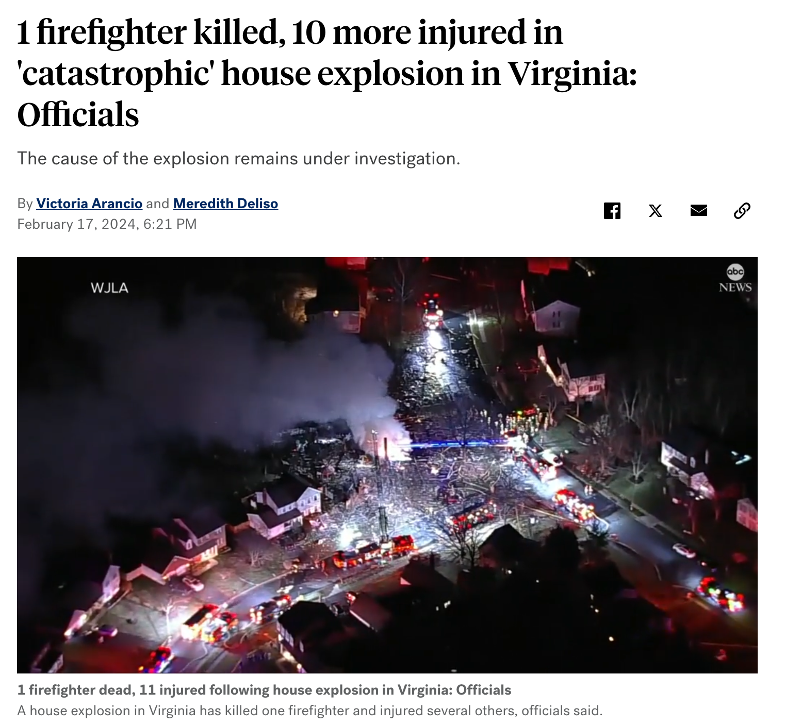{.absolute top="80" left="240" width="600"}

::: footer
Source: [February 17th, 2024 - Virginia](https://abcnews.go.com/US/1-firefighter-dead-11-injured-house-explosion-virginia/story?id=107312128)
:::

##

### Everyday Fast Violence

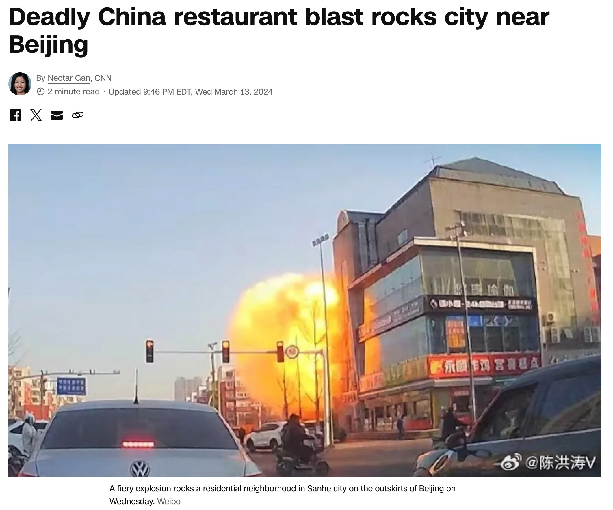{.absolute top="100" left="200" width="650"}

::: footer
Source: [March 13th, 2024 - Beijing, China](https://www.cnn.com/2024/03/13/china/china-hebei-restaurant-gas-explosion-intl-hnk/index.html
)
:::

##

### Slow Violence

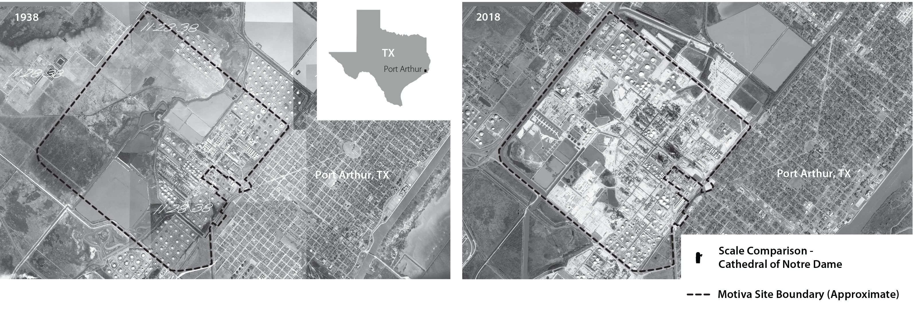{.absolute top="170" left="20" width="1900"}

::: footer
Source: [Slow Violence: Port Arthur Refinery Across Time](https://en.wikipedia.org/wiki/Port_Arthur_Refinery)
:::

##

### Fast (Geographic) + Slow Violence (Climate)

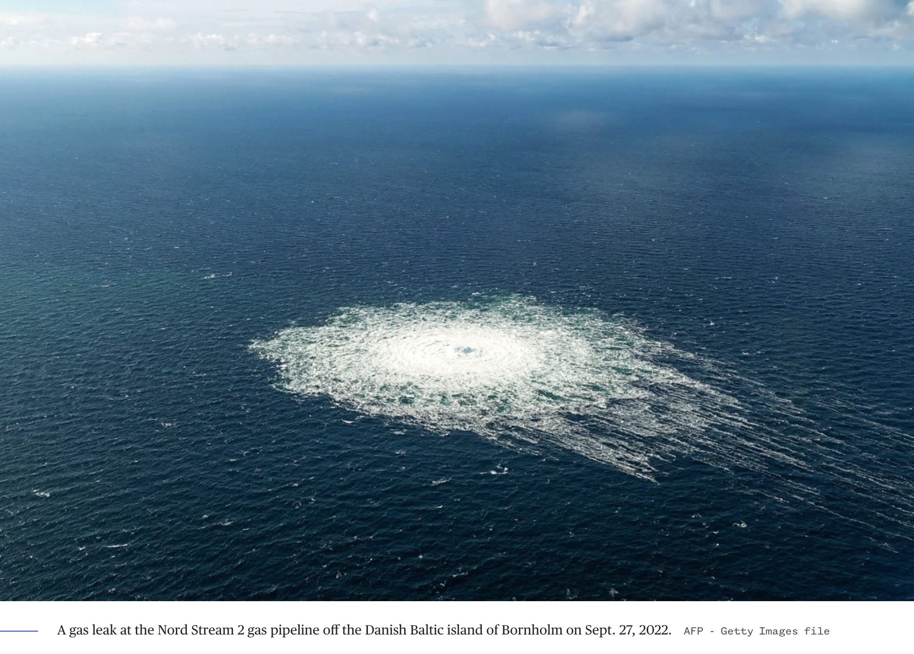{.absolute top="70" left="160" width="800"}

::: footer
Source: [Nord Stream 2 Explosion](https://www.nbcnews.com/news/world/sweden-ends-nord-stream-sabotage-probe-hands-evidence-germany-rcna137672)
:::

##

### Fast (Geographic) + Slow Violence (Climate)

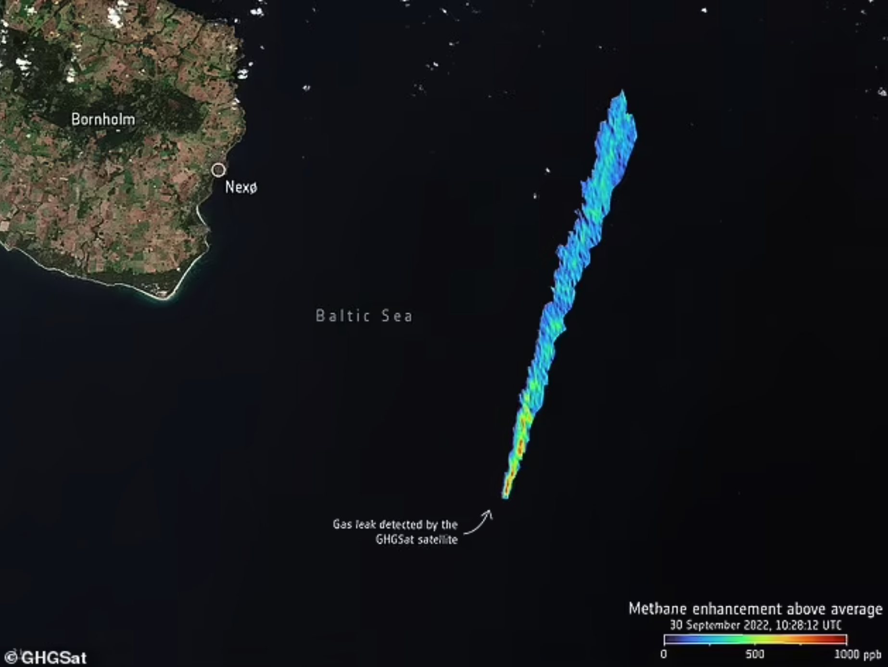{.absolute top="80" left="160" width="800"}

::: footer
Source: [Nord Stream 2 Explosion- ESA detection](https://www.esa.int/Applications/Observing_the_Earth/Satellites_detect_methane_plume_in_Nord_Stream_leak)
:::

##

### Fixed 'in place' Vulnerability - Environmental Justice (EJ)

> Environmental justice asks whether environmental benefits, burdens, and decision-making power are distributed fairly.

- Environmental conditions are shaped by social, economic, and political systems.

- Communities do not have equal exposure to environmental benefits and burdens.

- Communities also differ in their ability to influence environmental decisions.

##

### 1982 Warren County, North Carolina PCB landfill protests

> Environmental justice isn't simply the study of environmental inequality. It emerged as a demand by communities for fair treatment and meaningful participation in decisions affecting their environments.

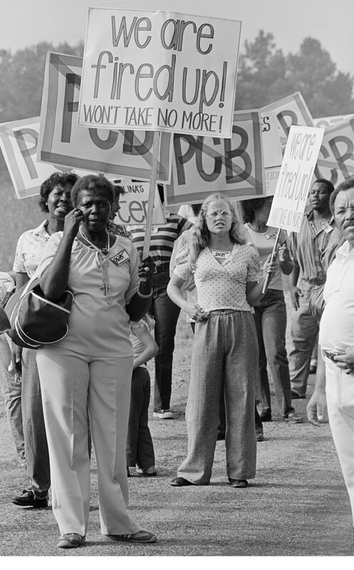{.absolute top="400" left="20" width="200"}

##

###  Disproportionate Burden

- Environmental hazards and amenities are not distributed equally.

- Low-income communities and communities of color have often experienced greater environmental burdens.

- These patterns reflect histories of land use, housing, infrastructure, industry, and political power.

- EJ asks whether unequal exposure becomes disproportionate burden.

##

### The Proximity of Vulnerable Populations:

::: {.incremental}

- *A **fenceline community or frontline community** is a neighborhood that is **immediately adjacent** to a company, military base, industrial or service center and is directly affected by the noise, odors, chemical emissions, traffic, parking, or operations of the company.*

- *These communities are exposed to hazardous chemicals, high pollution levels, and environmental degradation along with the threat of chemical explosions.*

- *Many fenceline communities are situated in **sacrifice zones** that are **disproportionately inhabited** by people of color, Indigenous communities, and the working poor.*

:::

::: footer
Source: [Fenceline community](https://en.wikipedia.org/wiki/Fenceline_community)
:::

##
### 4 Important Questions to ask when Confronting Environmental Justice Issues:

::: {.incremental}

1. What is the 'Size' or 'Scale' of both the hazard (environmental violence) and the vulnerable population(s)?

2. What is the 'Speed' of the hazard (environmental violence) - Fast or Slow?

3. How is a vulnerable population(s) typified? What is the regime of measurement for a vulnerable population(s)?

4. How is the hazard (environmental violence) measured?  How does this measurement relate to its regulatory framework?

:::

